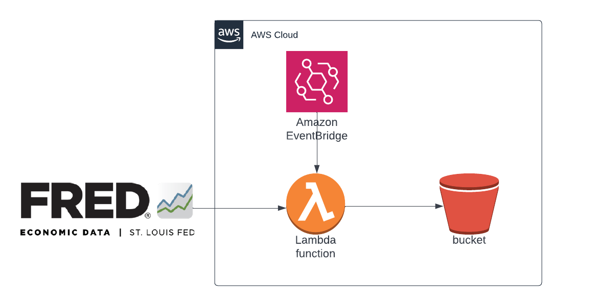

# FRED Data Extractor

Greetings! 

The fred data extractor is a work in progress and is under active development. 

This super simple batch processing application will pull data from the Federal Reserve of St. Louis FRED API
on a daily schedule and store the data in an S3 bucket. 

The purpose is simply to demonstrate that I know how to use AWS and can deploy AWS infrastructure through code, 
specifically, the AWS CDK.

Please consider hiring me :)

Obviously, this is only the E in a potential ETL pipeline. A real ETL pipeline would have:
- Separate, decoupled transform and load processes (likely in separate code bases)
- Idempotent tasks, whenever possible
- Error handling, retry logic, and failure notifications

